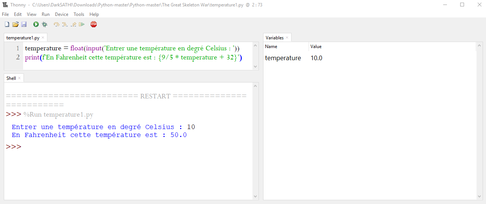

#  **Introduction au langage de programmation Python**
***

##  **[Guido Van Rossum](https://gvanrossum.github.io//)**


Guido van Rossum a conçu Python il y a maintenant une trentaine d'année. Ce langage de programmation objet, multi-paradigme et multi-plateforme sert à simplifier les tâches de programmation complexes. C'est en 1989, alors qu'il est en vacances pour Noël, que Guido van Rossum écrit la première version du langage, très inspiré du langage ABC. Pourquoi Python ? Parce que le développeur est un grand fan de la série télévisée Monty Python's Flying Circus. Guido van Rossum travaille aussi chez Dropbox.

##  **[Les aphorismes](https://fr.wikipedia.org/wiki/Aphorisme) pour la conception d'un programme Python**


```python
# À vous de traduire ces aphorismes.
import this
```

##  **L'EDI(Environnement de développement informatique) Thonny**

Thonny est distribué avec Python 3.7, vous avez donc besoin seulement d'installer le programme et vous êtes prêt à apprendre la programmation en Python : [télécharger Thonny](https://thonny.org/)

L'interface utilisateur initiale est dépourvue de toutes les fonctionnalités susceptibles de distraire les débutants.

**Cliquer sur l'image ci-dessous pour visionner une vidéo d'utilisation de Thonny**.

[](https://www.youtube.com/embed/nwIgxrXP-X4)

> On utilisera Thonny dans la section «Votre premier programme Python»

##  **Les variables en Python**

###  **Définition**

<p style="color:red">Une variable est une zone de la mémoire de l’ordinateur dans laquelle une valeur est stockée.
Pour le programmeur, cette variable est définie par un nom, alors que pour l’ordinateur, il s’agit d’une adresse en mémoire.<\p>


```python
mon_age = 47 # Affectation de la valeur numérique de type <int> à la variable mon_age.
print(mon_age)
print(id(mon_age))
print(id(47))
```

**Que s'est-il passé ?**

**Ligne** ```1```
- Python a automatiquement identifié que la variable est de type **```<int>```**, c'est à dire un entier. C'est ce que l'on appelle le typage dynamique.
- Python a réservé(on dira aussi alloué) l'espace mémoire défini en Python pour un entier.
- Python a assigné la valeur 47 à la variable **```mon_age```**.

**Ligne** ```2```
- La fonction built-in `print` permet d'afficher la valeur référencée par la variable **`mon_age`** dans la sortie standard.

###  **Les régles de nommage d'une variable**

- Le nom des variables en Python peut être constitué de lettres minuscules (a à z), de lettres majuscules (A à Z), de nombres
(0 à 9) ou du caractère souligné ( _ ). 
- Vous ne pouvez pas utiliser d’espace dans un nom de variable.
- Un nom de variable ne doit pas débuter par un chiffre et il n’est pas recommandé de le faire débuter par le
caractère _ (sauf cas très particuliers).
- Il faut éviter d’utiliser un mot « réservé » par Python comme nom de variable.
- Python est sensible à la casse, ce qui signifie que les variables **DarkSATHI**, **DARKSATHI** ou **darksathi** sont différentes.

**PEP 8 : Guide de style pour le code Python**
- Les noms de variables doivent être en minuscules, avec des mots séparés par des tirets bas si nécessaire pour améliorer la lisibilité.
```python
volume_du_rectangle = 10
```
- N'utilisez jamais les caractères 'l' (minuscule el), 'O' (majuscule oh) ou 'I' (majuscule) comme noms de variable à un seul caractère. Dans certaines polices, ces caractères ne se distinguent pas des chiffres un et zéro. Lorsque vous êtes tenté d'utiliser 'l', utilisez plutôt 'L'.
- Les constantes sont écrites en majuscules avec des tirets bas séparant les mots (C'est une variable dont la valeur ne devrait pas être modifiée.).
```python
DATE_NAISSANCE_GUIDO = "31 janvier 1956"
LIEU_DE_NAISSANCE_GUIDO = "Haarlem au Pays-Bas"
```


```python
# Les mots réservés en Python
import keyword
for mot_reserve in keyword.kwlist :
    print(mot_reserve)
```

###  **Le typage des variables en Python**

####  *Les Nombres Flottants*
`<float>`

- Un ordinateur ne travaille pas avec des nombres réels, mais avec des flottants, c’est-à-dire un sous-ensemble des nombres décimaux dont la précision est limitée par des contraintes liées au codage en mémoire.

- les flottants sont représentés en mémoire en base 2. Seuls sont donc éventuellement représentables les nombres qui admettent une écriture à virgule en base deux, on les appelle les nombres **dyadiques**.


```python
>>> type(1.5) # Déterminer le typage d'une valeur
```


```python
# lorsqu'on écrit 0.1 en Python, on ne manipule pas 0.1 mais le flottant le plus proche de cette quantité.
>>> format(0.1, '.55g')
```

- La valeur afficher en sortie n'est pas celle qui est stockée en mémoire.
- Pour ```0.1``` c'est la valeur approcrée $\dfrac{3602879701896397}{2^{55}}$ qui est utilisée pour les calculs.
- Python n'affiche que 18 chiffres significatifs.


```python
# Que pouvez-vous observer ?
>>> 0.1 + 0.1 + 0.1
```


```python
# Quelles informations sur les nombres flottants pouvons nous lire à l'exécution de ce code ?
import sys
print("Informations sur les flottants : ",sys.float_info)
```

####  *Les Nombres entiers*
`<int>`


```python
print("Information sur les entiers : ",sys.int_info)
```

> Les nombres entiers n'ont pour seul limite que l'espace mémoire que le systeme veut bien accorder au processus Python (2 Go maximum pour un Python en 32 bits et la totalité de la mémoire disponible pour un 64 bits).


```python
a = 0
sys.getsizeof(a)
```

####  *Les Chaînes de caractères (string)*
`<str>`


```python
nom = 'DarkSATHI'
print(nom)
nom2 = "DarkSATHI"
print(nom2)
nom == nom2
print(nom[0])
print(nom[-1])
```

###  **Les opérations sur les types numériques**

Les quatre opérations arithmétiques de base se font de manière simple sur les types numériques (nombres entiers et floats).

+ Les symboles **+, -, \*, \/, \*\*, \/\/** et **\%** sont appelés opérateurs, car ils réalisent des opérations sur les variables.


```python
x = 9
print(x + 7)
print(x - 5)
print(x * 2)
print(x - 2.0)
print((x + 2) * 5)
```

> **Si vous mélangez les types entiers et floats, le résultat est renvoyé comme un float.**

> **L’utilisation de parenthèses permet de gérer les priorités.**

+ L’opérateur **\/** effectue une division. Il renvoie systématiquement un float.


```python
print(15 / 5)
print(3 / 4)
```

+ L’opérateur puissance utilise les symboles **\*\***.


```python
print(2**4)
print(1.5**4)
```

+ Pour obtenir le quotient et le reste d’une division entière, on utilise respectivement les symboles **\/\/** et modulo **\%**.


```python
print(9 // 2)
print(9 % 2)
print(9 == 2 * (9 // 2) + 9 % 2)
```

- Les opérateurs combinés **+=, -=, \*=, \/=** : **Opération et affectation en une seule étape**.


```python
nombre = 3
nombre += 2
print(nombre)
nombre /= 5
print(nombre)
```

###  **Les opérations sur les chaînes de caractères**

+ Pour les chaînes de caractères, deux opérations sont possibles, l’addition et la multiplication.


```python
nom = 'DarkSATHI'
prenom = "Li"
user_name = nom + prenom
print(user_name)
user_name = nom + ' ' + prenom
print(user_name)
prenom_multiple = prenom * 4
print(prenom_multiple)
```

+ Les opérations illicites


```python
>>> 'Li' * 2.5
```


```python
>>> 'Li' + 7
```

###  **Les conversions de type**

En programmation, on est souvent amené à convertir les types, c’est-à-dire passer d’un type numérique à une chaîne
de caractères ou vice-versa. En Python, on utilise les fonctions built-in ``int()``, ``float()`` et ``str()``.

En anglais, toute conversion d’une variable d’un type en un autre est appelé ``casting``.


```python
nombre = 3
print(type(nombre))
nombre = str(nombre)
print(type(nombre))
nombre = '123'
print(type(nombre))
nombre = int(nombre)
print(type(nombre))
```

##  Votre premier programme Python


```python
temperature = float(input('Entrer une température en degré Celsius : '))
print(f'En Fahrenheit cette température est : {9/5 * temperature + 32}')
```

La première ligne demande à l'utilisateur d'entrer une température. La fonction ```input``` demande à l’utilisateur de taper quelque chose. 
La partie entre guillemets est l'invite visible par l'utilisateur. **C'est une chaîne de caractères**.
La fonction ```float``` est utilisée quand nous voulons que l'entrée saisie par l'utilisateur soit de type numérique.
Nous devons donner un nom à la valeur saisie par l'utilisateur pour que le programme puisse s'en souvenir et
l'utiliser à la deuxième ligne. 

Le nom que nous utilisons est ```température``` et nous utilisons le signe égal pour attribuer le
valeur à ```température```.

La deuxième ligne utilise la fonction ```print``` pour afficher le résultat de la conversion sur la sortie standard. **C'est une chaîne de caractères**.

La partie entre guillemets est une autre chaîne de caractères et apparaîtra à l'utilisateur de votre programme exactement tel qu'il apparaît entre les guillemets.



------------------
# A vous de jouer !

##  En français

- **Qu'est-ce que ce code produit?**
```python
a = 1
b = 3
print(a + b)
```
- **Qu'est-ce que ce code produit?**
```python
a = 1
b = 3
print("a+b")
```
- **Qu'est-ce que ce code produit?**
```python
x = 10
x + 1
print(x)
```
- **Qu'est-ce que ce code produit?**
```python
# print("DarkSATHI")
```
- **Écrivez une ligne de code qui imprimera votre nom.**
- **Comment rédiger-vous un commentaire dans un programme?**
- **Que font les lignes de code suivantes? Pourquoi donnent-ils un réponse différente?**
```python
print(2/3)
print(2//3)
```
- **Ecrivez une ligne de code qui crée une variable appelée _`pi`_ et la définit sur une valeur appropriée.**
- **Pourquoi ce code ne fonctionne pas?**
```python
A = 22
print(a)
```
- **Tous les noms de variables ci-dessous peuvent être utilisés. Mais lequel d'entre eux est le meilleur nom de variable à utiliser pour désigner l'aire d'un rectangle?**
```python
a
A
Aire
AIRE
aire
aire_du_rectangle
Aire_Du_Rectangle
```
- **Pourquoi ce code ne fonctionne pas?**
```python
print(a)
a = 45
```
- **Expliquez l'erreur dans ce code.**
```python
pi = float(3.14)
```
- **Expliquez l'erreur dans ce code.**
```python
x = 4
y = 5
a = 3(x + y)
print(a)
```
- **Expliquez l'erreur dans ce code.**
```python
radius = input(float("Donner le rayon du cercle en cm:"))
```

##  En Anglais

+ **For each of the following expressions, what value will the expression give? Verify your answers by typing the expressions into Python.**


```python
9 - 3
```


```python
8 * 2.5
```


```python
9 / 2
```


```python
9 / -2
```


```python
9 // -2
```


```python
9 % 2
```


```python
9.0 % 2
```


```python
9 % 2.0
```


```python
-9 % 2
```


```python
9 / -2.0
```


```python
4 + 3 * 5
```


```python
(4 + 3) * 5
```

+ **Write two assignment statements that do the following :**
  - Create a new variable, ```temp```, and assign it the value ```24```.
  - Convert the value in ```temp``` from Celsius to Fahrenheit by multiplying by ```1.8``` and adding ```32```; make temp refer to the resulting value.
  - What is ```temp```’s new value?
 

- **Write a bullet list description of what happens when Python evaluates the statement ```x += x - x``` when ```x``` has the value ```3```.**

- **When a variable is used before it has been assigned a value, a ```NameError``` occurs. In the Python shell, write an expression that results in a ```NameError```.**
